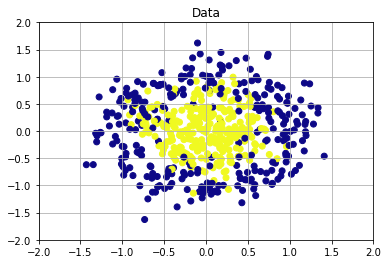
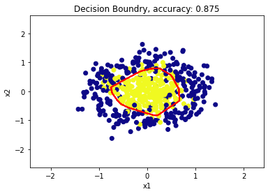
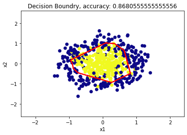
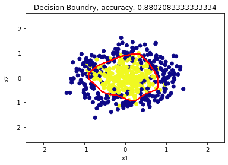
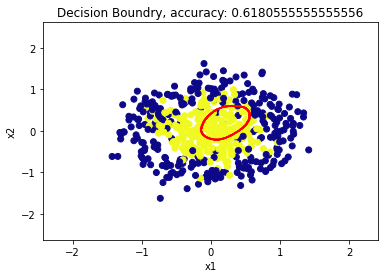

# Implementing a MLP Classifier with NumPy

In the notebook, a multi-layer Perceptron classifier is implemented using numpy library.

## Dataset

The dataset is created using sklearn's 'make_circles'.

## Results

<table class="tg">
<thead>
  <tr>
    <th class="tg-0pky">MLP</th>
    <th class="tg-0pky">Hidden layers</th>
    <th class="tg-0lax">Epochs</th>
    <th class="tg-0lax">Accuracy</th>
    <th class="tg-0lax">Plot</th>
  </tr>
</thead>
<tbody>
  <tr>
    <td class="tg-0lax">1</td>
    <td class="tg-0lax">8, 4, 4, 2</td>
    <td class="tg-0lax">200</td>
    <td class="tg-0lax">0.875</td>
    <td class="tg-0lax"></td>
  </tr>
  <tr>
    <td class="tg-0lax">2</td>
    <td class="tg-0lax">4, 2</td>
    <td class="tg-0lax">200</td>
    <td class="tg-0lax">0.8681</td>
    <td class="tg-0lax"></td>
  </tr>
  <tr>
    <td class="tg-0lax">3</td>
    <td class="tg-0lax">32, 16, 8, 4</td>
    <td class="tg-0lax">200</td>
    <td class="tg-0lax">0.8802</td>
    <td class="tg-0lax"></td>
  </tr>
  <tr>
    <td class="tg-0pky">4</td>
    <td class="tg-0pky">2048</td>
    <td class="tg-0lax">100</td>
    <td class="tg-0lax">0.6180</td>
    <td class="tg-0lax"></td>
  </tr>
</tbody>
</table>

